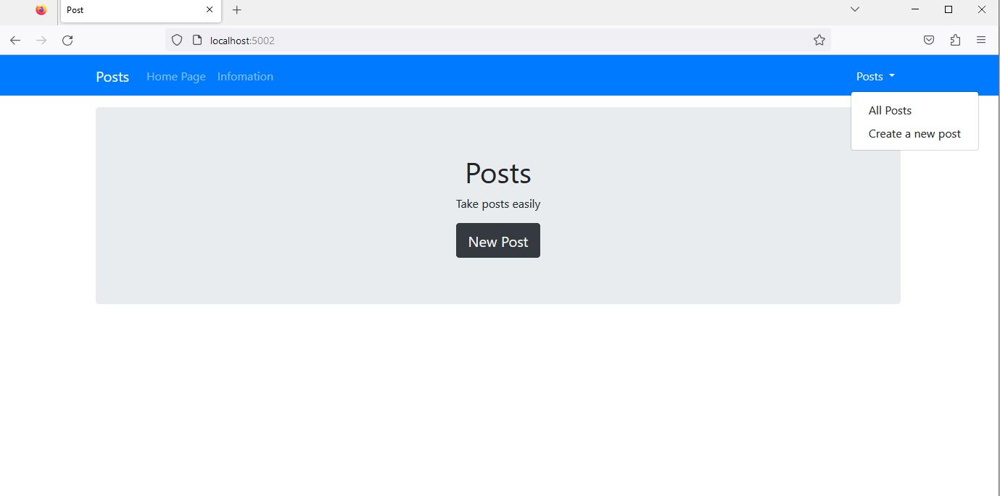
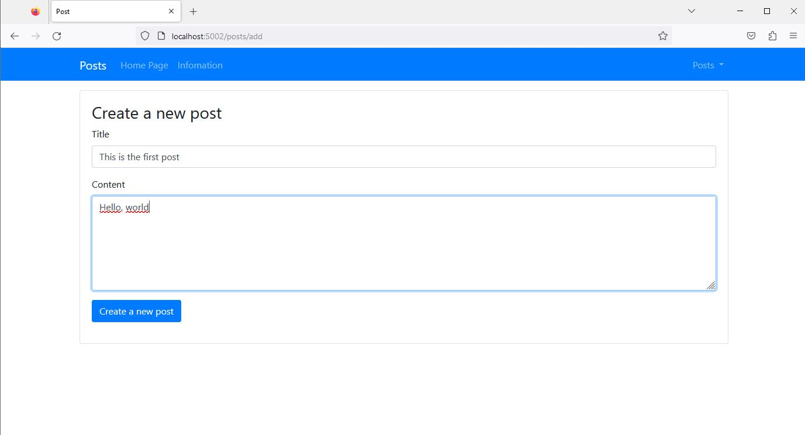
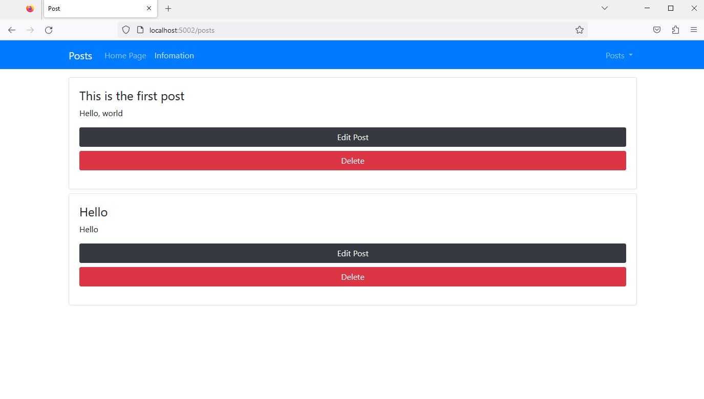
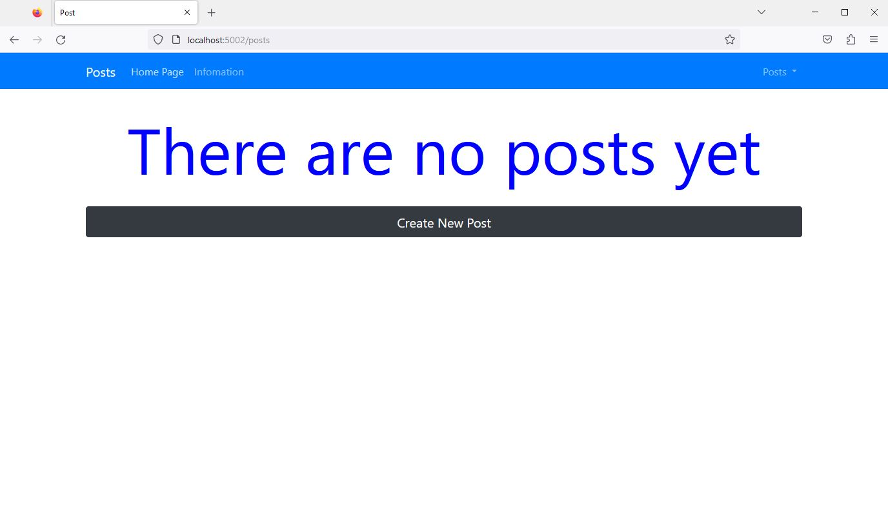

# This is a simple project to learn about CRUD (handle CRUD)

### 👉 About the project

Run a simple web application about allowing users to create, read, edit, and delete posts.

### 🛠 Start Developing

Once you did all that, install all dependencies with this command.

```bash
npm install
```

After all dependencies are installed, you are ready to go, run this to start the app:

```bash
npm start
```

You will see the app running on [http://localhost:5002](http://localhost:5002)

---

### ⭐️ Demo


Main UI: Users can click button New Post to create the post.

---


Users create post here.

---


Users can see all the posts here and can delete or update the post.

---


When users delete all posts or have not created a post yet. Then show a button Create New Post, so users can go to create a post.
